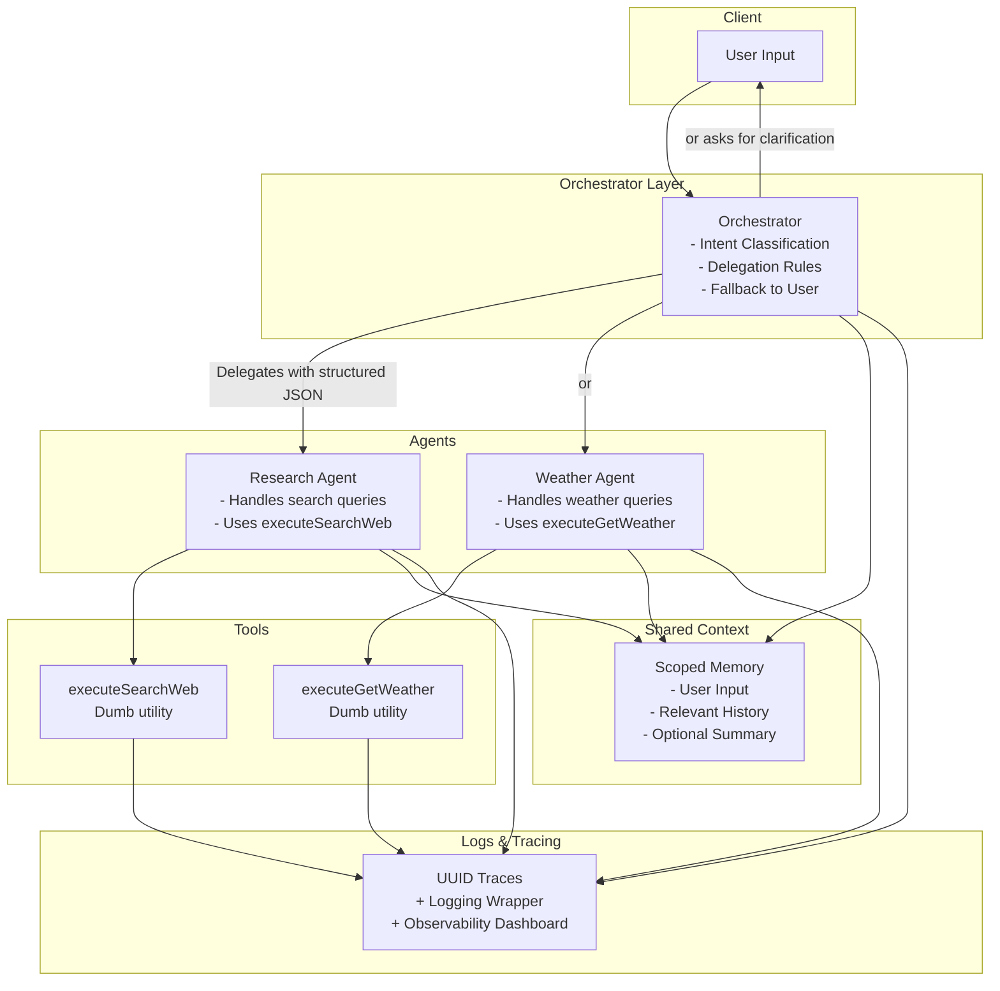

**Modular Multi-Agent Architecture for LLM-Orchestrated Systems**

This analysis synthesizes a comprehensive architectural and testing strategy for building a resilient multi-agent system powered by LLMs. The approach emphasizes strict modularity, explicit contracts, traceable execution, and composable logic. It draws on best practices in software design, pragmatic constraints of current LLM capabilities, and an overarching goal of minimizing emergent complexity.

---

### **Overview**

The system is built around three primary components:

1. **Orchestrator:** A stateless dispatcher responsible for classifying intent and delegating tasks.
2. **Agents:** Narrowly-scoped modules, each with a defined contract (input schema, tools, output format).
3. **Tools:** Stateless, composable functions that execute well-defined jobs (e.g., calling APIs), detached from orchestration logic.

The design prioritizes robustness through schema enforcement, minimal context propagation, structured logging, and layered testing.

---

### **Key Analysis**

#### 1. **Agents as Contractual Roles**

- Each agent is explicitly defined with:
  - **Name and Responsibility**: Clear domain of user inputs it can respond to.
  - **Input/Output Schema**: Enforces consistency and testability.
  - **Tools Access**: Limited, purpose-built utilities.
- Agents are not autonomous LLM personalities—they operate more like isolated microservices playing strict “language games” (cf. Wittgenstein).

#### 2. **Orchestrator as Explicit Dispatcher**

- Routing is not based on vague LLM intuition but on:
  - Keyword rules
  - Lightweight classifiers (e.g., OpenAI embeddings)
  - Structured JSON outputs to guide execution
- Orchestrator outputs a strict schema:
  ```ts
  type OrchestratorDecision =
    | {
        type: 'delegate';
        agent: 'research' | 'weather';
        args: Record<string, unknown>;
      }
    | { type: 'respond'; message: string }
    | { type: 'clarify'; question: string };
  ```

#### 3. **Scoped Context for Controlled Reasoning**

- Each agent receives:
  - Current user input
  - Select prior turns
  - Optional synthetic summary
- Prevents overloading with irrelevant data or hallucination risks

#### 4. **Tools as Stateless Utilities**

- Tools are designed like UNIX commands: minimal, testable, composable
- Example: `executeSearchWeb({ query }) → { output, sources }`
- Tools do not participate in orchestration or formatting—they only return raw results

#### 5. **Observability as Core Feature**

- Every function call (agent/tool/orchestrator) is logged with:
  - UUID session trace
  - Duration
  - Input/output
- Early trace tooling is encouraged to visualize orchestration paths
- Enables auditing, debugging, and pattern recognition over time

#### 6. **Test Strategy Grounded in Behavioral Contracts**

- **Unit Tests:** Ensure tools behave reliably with valid/invalid inputs
- **Integration Tests:** Validate orchestration logic (routing, agent delegation, formatting)
- **E2E Tests:** Simulate full flows through the chat interface
- **Mock LLMs and APIs** to reduce flakiness and cost
- Tests prioritize schema compliance and logical correctness over exact string matches

#### 7. **Incremental Agent Introduction**

- Begin with two agents (e.g., `Research`, `Weather`)
- Validate orchestration, test harnesses, logging, and tool integration
- Add new agents only after architecture proves stable

---

### **Open Questions**

- **Should agents evolve to maintain memory across sessions?** What boundaries must exist to prevent state leakage or long-term bias?
- **How should orchestration handle overlapping domains or ambiguous queries?** Could hybrid routing (classifier + LLM fallback) improve robustness?
- **What is the failure protocol when no agent is confident?** Is user clarification enough, or should a meta-agent handle escalation?
- **How does formatting unify across agents?** Should the Orchestrator manage this, or should each agent return user-facing text?

---

### **Implementation Considerations**

- Build each agent with a `validate → execute → return` lifecycle
- Use Zod or similar libraries to enforce input/output shape
- Create a shared logging utility with correlation IDs
- Wrap all external calls in error boundaries to avoid upstream collapse
- Implement a minimal trace viewer (e.g., simple dashboard showing logs and routing history)

---

### **Potential Challenges**

- **Latency Accumulation:** Chained agent/tool calls could slow response
- **Error Isolation:** Misbehaving agents must be sandboxed to avoid breaking global flow
- **User Experience Consistency:** Varying agent styles could create disjointed UX without a centralized formatting layer

---

### **Related Concepts**

- **Agent Orchestration Patterns**
- **Function Calling / Tool Use via LLMs**
- **LLM Agent Design (AutoGPT, BabyAGI comparisons)**
- **Service Mesh Analogies for AI Modules**
- **Cognitive Architectures (e.g., Blackboard Models)**

---

### **Mermaid Diagram (Architecture)**



---

### **Conclusion**

This architecture represents a shift from “do-everything” agents to a modular, maintainable, and traceable system of cooperating components. By treating agents as strictly-scoped functions, containing memory, and leaning into explicit contracts, this design lays the foundation for a scalable and resilient multi-agent AI runtime.

If desired, the next step could involve drafting concrete TypeScript implementations for the Orchestrator schema, ResearchAgent, and WeatherAgent—alongside a mockable test harness. Let me know if you’d like to proceed.
